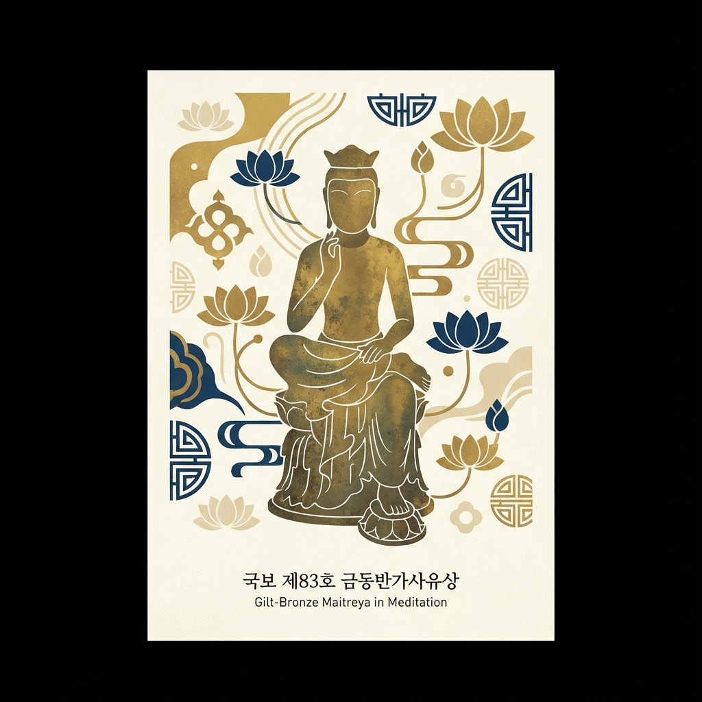

# 국립중앙박물관 AI 도슨트 데모

**QR 코드 기반 증강현실(AR) 전시 안내 시스템**



---

## 📱 프로젝트 개요

이 프로젝트는 국립중앙박물관의 유물에 QR 코드를 부착하여, 관람객이 스마트폰이나 태블릿으로 QR 코드를 스캔하면 해당 유물의 상세 정보가 증강현실(AR)로 표시되는 혁신적인 전시 안내 시스템입니다.

### 🎯 주요 특징

- **QR 코드 자동 인식**: 카메라가 QR 코드를 감지하면 자동으로 유물 정보 표시
- **실시간 위치 추적**: QR 코드의 위치와 각도에 맞춰 정보 패널이 자동으로 배치
- **상세 정보 제공**: 유물의 시대, 재질, 크기, 역사적 배경 등 풍부한 정보
- **반응형 디자인**: 스마트폰, 태블릿 등 다양한 기기에서 최적화된 경험
- **우아한 UI**: 한국 전통 미학을 반영한 금색/청동색 디자인

---

## 🏛️ 데모 유물: 금동미륵보살반가사유상

**국보 제83호 | 삼국시대 (7세기 전반)**

이 데모는 국립중앙박물관의 대표 유물인 **금동미륵보살반가사유상**을 소재로 제작되었습니다.

### 유물 정보
- **명칭**: 금동미륵보살반가사유상 (Gilt-Bronze Maitreya in Meditation)
- **시대**: 삼국시대 (7세기 전반)
- **재질**: 청동에 금도금
- **크기**: 높이 93.5cm
- **소장**: 국립중앙박물관 사유의 방
- **가치**: 한국 불교조각을 대표하는 걸작, 동양 불교 조각 중 최고의 작품

### 특징
- 오른쪽 다리를 왼쪽 무릎 위에 올리고 깊은 생각에 잠긴 반가사유 자세
- 둥근 얼굴에 잔잔한 미소를 띠고 있어 종교적 평온함과 신비로움을 자아냄
- 삼산관(三山冠)을 쓰고 있어 '삼산관반가사유상'이라고도 불림
- 국내 금동반가사유상 중 가장 큰 규모

---

## 🚀 사용 방법

### 1. 준비물
- 스마트폰 또는 태블릿
- QR 코드 스티커 (인쇄하여 사용)
- 최신 브라우저 (iOS Safari 17+ 또는 Chrome 권장)

### 2. 시연 단계

#### Step 1: QR 코드 준비
- 프로젝트에 포함된 `demo_qr.png`를 인쇄하거나
- 아래 URL로 새로운 QR 코드 생성:
  ```
  https://your-domain.com/museum/index.html
  ```

#### Step 2: QR 코드 부착
- 인쇄한 QR 코드를 유물 모형이나 전시 패널에 부착

#### Step 3: 앱 실행
- 스마트폰/태블릿에서 `museum/index.html` 접속
- 카메라 권한 허용

#### Step 4: QR 스캔
- 카메라로 QR 코드를 비추면 자동으로 유물 정보가 표시됨
- '상세정보' 버튼을 눌러 더 많은 정보 확인

---

## 💼 투자자 프레젠테이션 가이드

### 시연 시나리오

**1. 도입 (30초)**
> "안녕하십니까. 오늘 소개해드릴 제품은 국립중앙박물관을 위한 AI 도슨트 시스템입니다. 
> 기존의 오디오 가이드나 안내판과 달리, QR 코드와 증강현실 기술을 활용하여 
> 관람객에게 더욱 몰입감 있는 전시 경험을 제공합니다."

**2. 문제 제기 (30초)**
> "현재 박물관 관람객들은:
> - 유물 정보를 얻기 위해 작은 안내판을 읽어야 하고
> - 오디오 가이드는 별도 기기 대여가 필요하며
> - 다국어 지원이 제한적이고
> - 젊은 세대의 관심을 끌기 어렵습니다."

**3. 솔루션 시연 (2분)**
> "저희 솔루션을 시연해보겠습니다."
> 
> [스마트폰을 들고 QR 코드에 가까이 가져감]
> 
> "보시는 것처럼, QR 코드를 카메라로 비추기만 하면..."
> 
> [화면에 유물 정보가 자동으로 표시됨]
> 
> "유물의 상세 정보가 자동으로 나타납니다. 
> 국보 제83호 금동미륵보살반가사유상의 시대, 재질, 크기는 물론
> 역사적 배경과 예술적 가치까지 한눈에 확인할 수 있습니다."
> 
> [상세정보 버튼 클릭]
> 
> "더 자세한 설명이 필요하면 이렇게 펼쳐볼 수 있고,
> 향후에는 음성 안내, 다국어 지원, 3D 모델 뷰어 등의 기능도 추가할 예정입니다."

**4. 핵심 가치 제안 (1분)**
> "이 시스템의 핵심 가치는:
> 
> ✅ **낮은 도입 비용**: QR 스티커만 있으면 되므로 별도 하드웨어 불필요
> ✅ **쉬운 업데이트**: 정보 수정이 필요하면 서버에서 즉시 반영
> ✅ **확장 가능성**: 전국 모든 박물관, 미술관, 전시관에 적용 가능
> ✅ **데이터 수집**: 관람객의 관심사와 동선 분석으로 전시 개선
> ✅ **MZ세대 친화적**: 스마트폰 기반으로 젊은 세대의 참여 유도"

**5. 비즈니스 모델 (30초)**
> "수익 모델은:
> - B2G: 국공립 박물관/미술관 대상 SaaS 구독 서비스
> - B2B: 사립 박물관, 갤러리, 기업 전시관
> - 광고/스폰서십: 특별전 협찬 기업의 정보 노출
> - 데이터 분석: 관람 패턴 분석 리포트 판매"

**6. 마무리 (30초)**
> "국립중앙박물관을 시작으로, 전국 300여 개 박물관으로 확장하여
> 대한민국의 문화유산을 더 많은 사람들에게 알리는 데 기여하겠습니다.
> 감사합니다."

---

## 🎨 기술 스택

- **Frontend**: HTML5, CSS3, JavaScript (Vanilla)
- **AR Technology**: Web Barcode Detection API
- **Camera**: MediaDevices API (getUserMedia)
- **Responsive Design**: Mobile-first approach
- **Browser Support**: iOS Safari 17+, Chrome 90+

---

## 📊 향후 개발 계획

### Phase 1: MVP (현재)
- ✅ QR 코드 인식 및 정보 표시
- ✅ 반응형 UI/UX
- ✅ 기본 유물 정보 제공

### Phase 2: 고도화 (3개월)
- 🎧 음성 안내 기능
- 🌐 다국어 지원 (영어, 중국어, 일본어)
- 📸 유물 사진 갤러리
- 💾 관람 기록 저장

### Phase 3: 확장 (6개월)
- 🎮 3D 모델 뷰어
- 🤖 AI 챗봇 도슨트
- 📱 전용 모바일 앱
- 📊 관리자 대시보드

### Phase 4: 플랫폼화 (12개월)
- 🏛️ 전국 박물관 네트워크
- 🎯 개인화 추천 시스템
- 🎓 교육 콘텐츠 연동
- 🛍️ 기념품 쇼핑 연계

---

## 🔧 설치 및 실행

### 로컬 테스트
```bash
# 프로젝트 디렉토리로 이동
cd revive_ar_demo/museum

# 간단한 HTTP 서버 실행
python3 -m http.server 8000

# 또는 Node.js 사용
npx http-server -p 8000

# 브라우저에서 접속
# http://localhost:8000
```

### 배포
- Netlify, Vercel, GitHub Pages 등 정적 호스팅 서비스 사용
- HTTPS 필수 (카메라 권한 요구사항)

---

## 📝 URL 파라미터

유물 정보를 URL 파라미터로 변경할 수 있습니다:

```
index.html?name=금동미륵보살반가사유상&period=삼국시대&material=청동에 금도금&size=높이 93.5cm&location=국립중앙박물관
```

- `name`: 유물명
- `period`: 시대
- `material`: 재질
- `size`: 크기
- `location`: 소장처

---

## 🎯 타겟 시장

### 1차 타겟: 국공립 박물관
- 국립중앙박물관
- 국립현대미술관
- 국립민속박물관
- 지역 시립/도립 박물관

### 2차 타겟: 사립 문화시설
- 사립 박물관/미술관
- 갤러리
- 기업 전시관
- 테마파크

### 3차 타겟: 해외 진출
- 한류 문화 전시
- 해외 한국 문화원
- 국제 박물관 협력

---

## 💡 경쟁 우위

| 항목 | 기존 오디오 가이드 | 저희 솔루션 |
|------|-------------------|-------------|
| 도입 비용 | 높음 (기기 구매) | 낮음 (QR 스티커) |
| 유지보수 | 어려움 (기기 관리) | 쉬움 (서버 업데이트) |
| 업데이트 | 복잡함 | 즉시 반영 |
| 다국어 | 제한적 | 무제한 확장 |
| 데이터 수집 | 불가능 | 가능 |
| 사용자 경험 | 구식 | 현대적/직관적 |

---

## 📞 문의

프로젝트에 대한 문의나 투자 상담은 아래로 연락주세요:

- **Email**: contact@museum-ar.com
- **Website**: https://museum-ar.com
- **Demo**: https://demo.museum-ar.com/museum

---

## 📄 라이선스

이 프로젝트는 데모 목적으로 제작되었습니다.

---

**Made with ❤️ for Korean Cultural Heritage**
